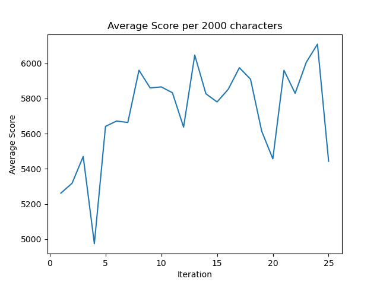

# Excellent Ergonomics
## A Reinforcement Learning Approach to Typing
## By: Tyler Conley

## I. Abstract

Fast, efficient keyboard typing is something sought after by many different people of many different disciplines.
There have been many standardized keymaps that have been developed using many various parameters, all of which
make some iterative improvements over the last. For all of the people seeking to get the most work out of their
typing, or that have finger or wrist problems that affect their ergonomics, there is a need to have a better-made
keyboard layout to better suit their needs. This report studies the effectiveness and results of using a 
reinforcement learning approach to calculate an optimized keymap. After some training, the agent could generate
a keymap that would would be personalized depending on who is typing after studying their typing speed and behaviors.
This program shows that reinforcement learning is a valid approach to any optimization problem with a varied number
of solutions, and shows that keyboard layouts are something that can be optimized well.

## II. Intro

Excellent Ergonomics is a utilization of reinforcement learning applied to experimenting in such a way to make
user ergonomics better for keyboards. The mechanical keyboard community is surprisingly big, and is something I've
taken interest in. This project works to find a "best" keymap for a keyboard, using a reinforcement learning agent
to learn which keymaps work best and which ones don't work very well. There are very few resources pertaining to
keyboard-focused reinforcement learning, so this project will also fill a sort of niche there.

The way to utilize a reinforcement learning algorithm is through making this problem sequential; or in other words,
by being able to step from one state to another. In this way, we can find a result for each step in
the algorithm, thus creating a sequential path for the algorithm to take and learn by.

The problem which the reinforcement algorithm computes is as follows:

* Given: The score for a keyboard layout
* Find: The best keyboard layout
* Such that: The score is minimized

In this algorithm, the score is based on any number of parameters. For the current iteration of the program, the score
is calculated with a grid of subscores for each spot on the keyboard. Each time a key in a certain position is pressed,
the score is incremented by that subscore. This goes until the environment uses the keymap to type through some number
of sample characters.

## III. Methods

In order to make this project a reality, not only is a reinforcement learning agent necessary, but a new environment will
be too, with there being a lack of keyboard-based reinforcement learning resources. This environment is linked to a directory
of various books (downloaded from [gutenberg.org](https://www.gutenberg.org/)), which it reads in, one at a time, to use
for its scoring, as noted in the previous section. The order at which it picks the books is randomized, so as to not make 
the algorithm deterministic, having the same input each time. 

The current iteration of the agent uses a simple Q-learning table to hold the memory of its state-action pairs. It also
utilizes a random-decay parameter to start generating optimized keymaps as it learns more about its environment. Its
Q-table is initialized with all zeros, and gets filled with "state indexes" and "action indexes". These indexes are held
in a separate dictionary, holding an index for each visited state and action. As it generates random keymaps while exploring,
the Q-table gets filled with these indexes. After a while, the agent starts acting greedily, choosing the best found keymap
given a specific state.

This approach to reinforcement learning is quite hefty, and requires a lot of iterations to be considered "well-learned". There
are a huge amount of combinations that can comprise a keymap (3.72e+41), and it will take many iterations to generate enough state-action
pairs to fill up the entirety of the Q-table. This requires a huge amount of data. Since that is the case, a future utility to
be added to the project is a web scraper to find a lot more text samples to use for input data for the agent. In its current state,
the agent only generates and explores up to 1000 keymaps. This approach is quite light on computation power, but can lead to
quite varied results. 

Other future improvements would be a neural network implementation to improve the memory model, additions to the environment to
include bi- and tri-graphs to the scoring system, since two- and three-letter combinations are differently affected than just
typing each letter one at a time.

## IV. Results

The results of this program can vary quite extremely. Since only 1000 out of 3.72e+41 keymaps are analyzed and explored,
there are many keymaps that cannot be optimized by the agent in its current state.

The above graph shows improvement over time for the agent. For these results, a lower score is
better. The results shown above show that after the agent explores many keymaps, it can find keymaps
that are much more efficient.

However, that is not always the case. Since there are only 1000 keymaps analyzed, the agent tends to trend,
as it finds itself in local maxima and minima. This can lead to a poor performing agent, which gets worse
and worse the more iterations it completes.

Overall, the performance of the agent could have been a lot better. Utilizing a neural network and temporal difference
would allow the agent to compute information for a lot more keymaps and their optimiztion. In its current state,
the output of the agent is not very usable.

## V. Summary

We have seen that the reinforcement learning approach has a lot of depth required to properly implement an agent to
explore many keymaps and find an optimal one. There are many improvements to be made to the agent as is. However,
there have been many mathematical methods applied to computing better keymaps, and a reinforcement learning, with
more advanced techniques and better memory utilization, will be able to properly find a more optimized keymap just
as well, perhaps even better.

## VI. Conclusions

Reinforcment learning performs excellently with problems that have numerous possible solutions. Designing a keyboard
layout that performs well is one such problem. The environment and agent in this project are designed to optimize
a keyboard layout in such a way. While it is possible to mathematically compute a more optimized layout in various
way, a reinforcement learning agent will be able to explore the various options of keyboard layouts, eventually
possibly being able to customize a keyboard layout personalized for a specific individual.

However, the agent and environment provided in this project are rather insufficient to properly show results
leading to these supposed conclusions. With more advanced reinforcement learning techniques, better results
can eventually be attained. These include a proper neural network to better model the sequential problem, and adding
more particular scoring returned by the environment.

While the results in this report and project are lacking, a lot was learned in pursuit of this project. Utilizing an
agent in this manner revealed the difficulty in using reinforcement learning to solve problems with a large possible
solution space. Additionally, it showed the weakness of reinforcement learning of being susceptable to falling into
local extrema, turning into short-term trends instead of proper results.

## VII. Sources

* [The search for the world’s best keyboard layout](https://paulguerin.medium.com/the-search-for-the-worlds-best-keyboard-layout-98d61b33b8e1), https://paulguerin.medium.com/the-search-for-the-worlds-best-keyboard-layout-98d61b33b8e1
* [white_keyboard_layout](https://github.com/mw8/white_keyboard_layout), https://github.com/mw8/white_keyboard_layout
* [The Keyboard Layout Project](https://mathematicalmulticore.wordpress.com/the-keyboard-layout-project/), https://mathematicalmulticore.wordpress.com/the-keyboard-layout-project/
* [Generating Optimal Keyboard Layouts (with Code)](https://codeburst.io/generating-optimal-keyboard-layouts-with-code-44f1752c48cc), https://codeburst.io/generating-optimal-keyboard-layouts-with-code-44f1752c48cc

[Link to my Github Project:](https://github.com/tylerTaerak/excellent-ergonomics) https://github.com/tylerTaerak/excellent-ergonomics
